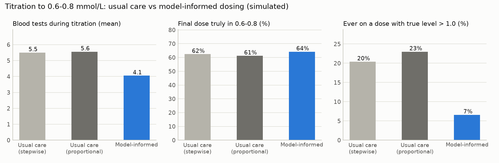
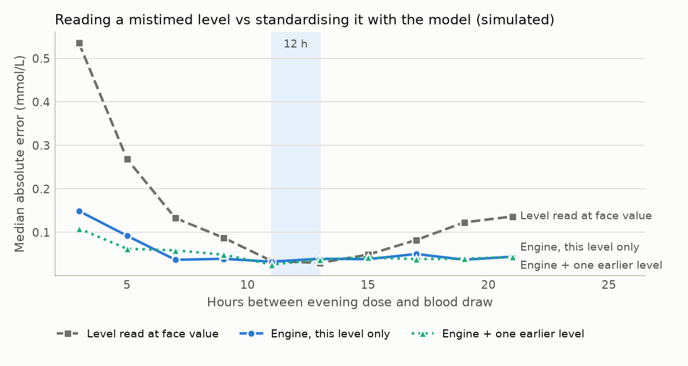
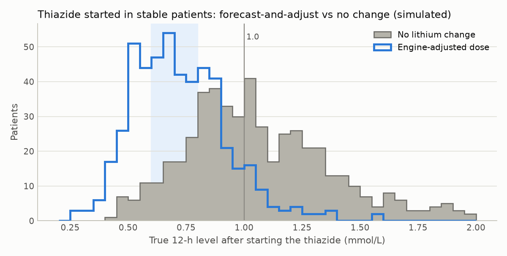
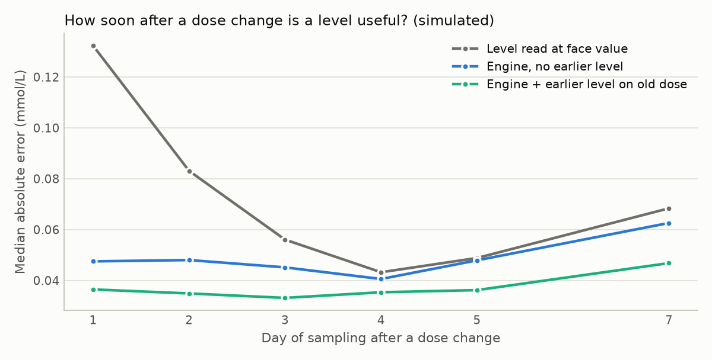

# In-silico trials: methods, results and caveats

Reproduce with `cd lithium && pip install numpy scipy matplotlib && python -m sim.run_all --n 500`. That takes about 12 minutes on 4 cores.
- Raw per-patient output goes to `sim/results.json`.
- Summary tables go to [`SIMULATION_RESULTS.md`](SIMULATION_RESULTS.md).
- The drift sensitivity analysis is `python -m sim.sensitivity`.

## Why simulate first

Before asking patients or clinicians to trust a model, we want to know whether the *mechanisms* behave as intended. Four claims need testing:

- Any-time levels can be standardised.
- Bayesian titration reaches target with fewer tests and fewer high levels.
- Interaction forecasts prevent high levels.
- A level drawn soon after a dose change is already informative.

The test must be adversarial: the engine must not be allowed to "know" the truth.

## Design

**Virtual population.** Adults resembling a bipolar-disorder clinic:
- 80% aged 42 ± 12 and 20% older adults aged 74 ± 5;
- 55% women;
- BMI 29 ± 5.5;
- eGFR declining with age (mean 112 − 0.85 × (age − 20), SD 14, range 35–135).

**Truth ≠ engine (deliberate misspecification).** Patients are generated from a `truth-perturbed` model. It differs from the engine's prior in structure, covariates, variability, drift and absorption:

| | Truth (generates patients) | Engine prior (what dosing uses) |
|---|---|---|
| Models | One two-compartment model | Ensemble: • kidney-function two-compartment model (prior weight 0.75); • a published one-compartment model (Methaneethorn 2019, weight 0.25), used only for age < 65 with eGFR ≥ 60 |
| Clearance | ∝ (de-indexed CKD-EPI eGFR)^0.75, 10% lower in women | 23% of Cockcroft–Gault CrCl (kidney model); weight and age only (published model) |
| Volume | ∝ total weight^0.9, split 45% central / 55% peripheral | ∝ fat-free mass, split 55/45 (kidney model); fixed 54 L (published model) |
| Between-subject variability | CL 32%, V 30% | CL 25% and 20%; V 20% |
| Within-person clearance drift | Slow SD 0.12 (τ 540 d) plus fast SD 0.12 (τ 14 d), on a daily grid | Slow SD 0.10 (τ 730 d) plus fast SD 0.08 (τ 21 d) |
| Absorption | IR ka 1.5 /h; MR ka 0.30 /h, F 0.90 | IR ka 1.2 /h; MR ka 0.40 /h, F 0.95 (published model: 0.426 /h) |
| Thiazide effect on clearance | Median ×0.70 (90% range 0.50–0.90) | Catalogue ×0.76 (0.60–0.92) |

**What the engine sees** is only what a clinic would see:
- **Prescribed doses.** The engine assumes every prescribed dose was taken. In truth, 80% of patients miss 3% of doses and 20% miss 15%.
- **Measured levels.** Assay CV 4%, plus an additive SD of 0.02 mmol/L, rounded to 0.01.
- **Recorded sample times.**
  - Model-informed arms: recorded to ±15 min, because the design captures dose and sample times.
  - Usual care: the clinician assumes a 12-hour level.

**Realistic sampling times** after a 21:00 dose:
- 60% in the morning (11–13.5 h);
- 30% in the late morning or afternoon (13.5–19 h);
- 10% after work (19–22 h).

**Held-out population.** Virtual patients were generated with seed 2026 while the engine and the trial code were being developed and debugged. All results below come from a fresh population (seed 4242) that was not looked at during development.

## Experiments

### 1. Titration to 0.6–0.8 mmol/L

Once-nightly immediate-release lithium carbonate, 250 mg tablets, 8-week horizon. Three arms:

- **Usual care, stepwise.**
  - Start 500 mg (250 mg if aged 65 or over).
  - First level at 1 week, read at face value.
  - Adjust by ±250 mg (±500 mg if < 0.4 or > 1.0).
  - Re-check a week after each change.
- **Usual care, proportional** (a strong comparator). As above, but the new dose = old × 0.7 / level, rounded to 250 mg and capped at ±500 mg per step.
- **Model-informed.**
  - The model chooses a lead-in (about half the maintenance dose for 3 days), then the model-predicted maintenance dose. It declines to plan a start below CrCl 30 mL/min.
  - Levels are taken at convenient times, with the timing recorded.
  - A Bayesian update and recommendation follow every level.
  - A "repeat level first" answer means a better-timed level 3 days later, with no dose change.

**Same stopping rule in every arm:** two consecutive levels on the same dose that the arm reads as in range.
- Usual care reads the raw level.
- The model-informed arm reads the engine's standardised estimate, and the engine must also recommend no change. At least one of the two levels must be drawn 3.3 or more estimated half-lives after the last change (near steady state), as usual care's weekly levels are.

**Outcomes:**
- blood tests;
- days to confirmed stability;
- whether the *true* 12-hour level on the final dose is in range;
- the day from which the patient stays on a truly therapeutic dose;
- ever being on a dose whose true level exceeds 1.0;
- dose changes.

### 2. Any-time sampling

Stable once-nightly patients, with a true 12-hour level spread across 0.4–1.1. One level is drawn uniformly 2–22 h after the evening dose. Truth is what a correctly timed 12-hour sample would have shown that morning. Three readings are compared:
- the raw level at face value;
- the engine with that level only;
- the engine with one earlier level on record.

### 3. Thiazide started in a stable patient

The true clearance effect is drawn from the truth distribution in the table above; the engine uses its catalogue value. Two actions are compared:
- no lithium change;
- the engine's pre-emptive dose adjustment.

Outcome: the true 12-hour level after starting.

### 4. Early sampling after a dose change

One earlier level on the old dose (or none). The dose is increased by about 40%, and a level is drawn 12 h after the dose on day 1, 2, 3, 4, 5 or 7. Outcome: error in the estimated new steady-state 12-hour level.

## Results

Full tables: [`SIMULATION_RESULTS.md`](SIMULATION_RESULTS.md). Figures: `docs/figures/`.

One virtual patient (82 years old, CrCl 29 mL/min) was excluded from every experiment: the engine declines to plan a lithium start below 30 mL/min.

### 1. Titration

| Outcome (499 patients) | Usual care, stepwise | Usual care, proportional | Model-informed |
|---|---|---|---|
| Blood tests, mean (median) | 5.6 (6) | 5.5 (6) | 4.6 (4) |
| Confirmed stable within 8 weeks | 59% | 62% | 92% |
| Final dose truly in 0.6–0.8 | 58% | 58% | 71% |
| Final dose truly in 0.5–0.9 | 84% | 85% | 93% |
| On a truly therapeutic dose from day (median) | 24 | 23 | 13 |
| Ever on a dose with true 12-hour level > 1.0 | 21% | 24% | 7% |

The advantage holds in the groups where lithium is most feared:

| Subgroup | Arm | Tests (mean) | Final truly in 0.6–0.8 | Ever on a dose > 1.0 |
|---|---|---|---|---|
| Aged 65+ (n = 120) | Usual care, stepwise / proportional | 5.6 / 5.5 | 57% / 56% | 29% / 28% |
| | Model-informed | 5.3 | 65% | 4% |
| eGFR < 60 (n = 63) | Usual care, stepwise / proportional | 5.4 / 5.4 | 49% / 51% | 38% / 35% |
| | Model-informed | 5.6 | 68% | 6% |
| Missing 15% of doses (n = 90) | Usual care, stepwise / proportional | 6.3 / 5.9 | 40% / 48% | 47% / 49% |
| | Model-informed | 5.3 | 57% | 14% |

In older adults and those with reduced kidney function, the model-informed arm used about as many tests as usual care. The gain there is mainly accuracy and safety, not fewer tests.

**Partial adherence is the hardest case for every arm.** Low levels caused by missed doses tempt any method to increase the dose. The patient is then over-exposed on the days they take every dose. The engine's "confirm adherence first" prompt, which the simulation ignores, targets exactly this.

### 2. A level drawn at a convenient time

Across 499 stable patients sampled 2–22 h after a night-time dose:

- **Error.** Median absolute error against a correctly timed 12-hour level fell from **0.101 mmol/L** (reading the level at face value) to **0.045** (engine).
- **Classification.** The share of samples put in the wrong category (below / in / above 0.6–0.8) fell from **31% to 17%**.
- **Calibration.** The engine's 90% intervals contained the truth **93%** of the time.
- **By time of day:**
  - *Late samples (18–22 h):* the gain was largest. Error fell from 0.133 to 0.038, and wrong category from 42% to 12%.
  - *Samples at 10–14 h:* the raw level was as good as it gets. Error was 0.032 at face value vs 0.039 for the engine, and wrong category 11% vs 13%. The engine adds nothing to a correctly timed level; the product therefore shows the measured value first, always.
  - *Samples within 6 h of a dose:* face value was badly wrong (error 0.383; wrong category 53%). The engine reduced the error to 0.115, but still misclassified 38%, and its interval coverage fell to 80%. This is why the product asks for samples at least 6 h after a dose, and returns "repeat level first" when a sample can't support a decision.

**Older levels help only sometimes.** Adding a second level from 45 days earlier left the overall error unchanged (0.045 vs 0.045). It helped for early samples (0.083 vs 0.115 at 2–6 h) and hurt at 6–10 h (0.050 vs 0.038). It also narrowed the intervals too much: coverage fell to 77–91%.

The virtual patients' clearance drifts more between visits than the engine assumes, so the engine over-trusts old data. The sensitivity analysis below tests this explanation.

### 3. A thiazide is started in a stable patient

| True 12-hour level afterwards | No lithium change | Engine-adjusted dose |
|---|---|---|
| > 1.0 mmol/L | 54% | 9% |
| > 1.2 mmol/L | 31% | 3% |
| 0.5–0.9 | 32% | 73% |
| < 0.5 | 2% | 11% |

**What the adjustment achieved.** The pre-emptive adjustment cut the share above 1.0 six-fold and the share above 1.2 ten-fold.

**The price.** 11% ended below 0.5. The truth's interaction effect varies more than the engine's catalogue says, so a dose cut sized for the average patient over-corrects some.

**Not a substitute for the check level.** The engine's 90% forecast interval for the no-change level contained the truth in only **68%** of patients. The design therefore always pairs a forecast with a level 5–7 days after starting. Interaction effect sizes should be learned from outcomes as data accrue.

### 4. How soon after a dose change is a level useful?

**Days 1–3.** A level taken 1–3 days after a dose change, read by the engine, estimated the new steady state nearly as well as a face-value reading taken on days 4–5:
- engine error on days 1–3: 0.046–0.055;
- face-value error on days 4–5: 0.040–0.045;
- face-value error on day 1: 0.128, and 0.080 on day 2.

**Day 5 onwards.** Near steady state, the raw level was slightly better than the engine (0.040–0.042 vs 0.047–0.055).

This supports early checks after a change when a decision is pending. It also supports deferring to the measured value once a level is a true steady-state 12-hour level.

### 5. Sensitivity: is drift the reason old levels don't help?

The engine's drift variances were set equal to the truth's, and 300 held-out patients were rerun (`python -m sim.sensitivity`):

| Engine drift | This level only | + one level from 45 days earlier |
|---|---|---|
| Engine's own (smaller than the truth's) | 0.043 | 0.049 |
| Matched to the truth | 0.039 | 0.042 |

**Drift explains part of it, not all.**
- With the right drift, both errors fell, and the penalty for adding an old level halved.
- But the old level still did not help. Read through a structural model that is slightly wrong (volume, absorption, covariates), an old level adds a little bias along with its information.

**Two practical consequences:**
1. Drift magnitudes must be estimated from real longitudinal data before history is trusted.
2. Until then, the engine should weight recent levels most. The product shows how much each level contributes.

## What the simulations caught during development

The in-silico trials found real defects before any patient was involved. Each was fixed before the results above were produced:

1. **The step-size guardrail locked some patients on their first dose.**
   - The guardrail limited a change to 1.5× the current dose. With 250 mg tablets, that ruled out 250 → 500 mg and 500 → 250 mg.
   - Patients started low, often older adults, were stuck at subtherapeutic levels.
   - An earlier stopping rule counted repeated "no change" as stability, which hid the problem.
   - Fix: one tablet up or down is always allowed.
2. **"Repeat level first" blocked interaction adjustments.**
   - The rule that defers a decision when evidence is weak also fired on thiazide forecasts, where the uncertainty comes from the interaction itself.
   - In the first run, half of the "engine-adjusted" doses were the unchanged dose. After the fix it was 20%: patients whose forecast stays in range with the thiazide.
   - Fix: the rule no longer applies to forecasts of an interaction or pregnancy effect.
3. **Unequal stopping rules.** The model-informed arm originally stopped after two "no change" decisions, which is laxer than usual care's two in-range levels. Both arms now use the same rule.
4. **A simulation artefact.** The truth's clearance drift changed in weekly jumps, which penalised estimates made just after a jump. The drift is now simulated daily.

## Caveats (read before quoting any number)

- **Mechanisms, not effectiveness.** These are simulations. They test whether the *mechanisms* work under stated assumptions; they are not evidence of clinical effectiveness.
- **The truth model is invented.** It was made to be *different* from the engine, not to be *right*. Real-world misspecification could be larger or smaller.
- **Stylised usual care.** Real practice is more variable: better in experienced lithium clinics, and worse where follow-up is lost or rechecks never happen.
- **Assumed behaviour.** Adherence, sampling behaviour and drift magnitudes are assumptions. They must be estimated from real data.
- **Tuned on the same world.** Decision thresholds (step limits, the "repeat first" rule, inertia around the current dose) were set during development on these simulations, although results are reported on a held-out population. Real-world validation (see [`VALIDATION.md`](VALIDATION.md)) is the test that matters.
