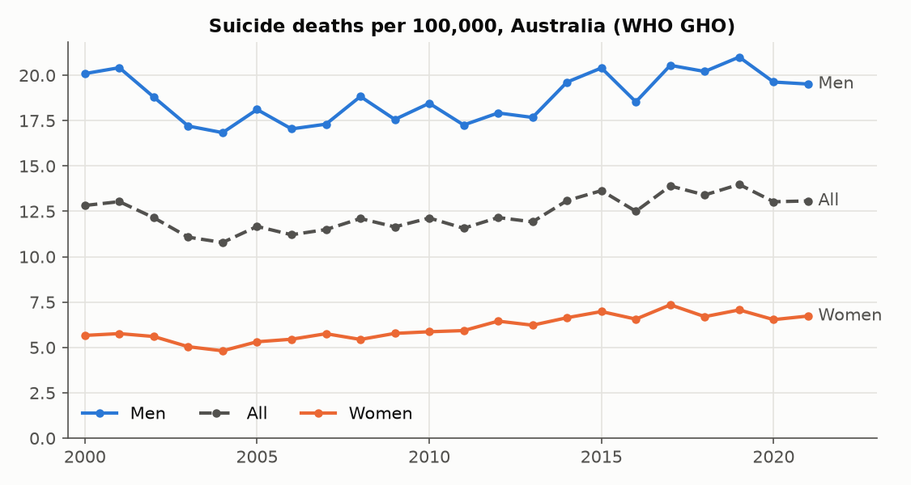
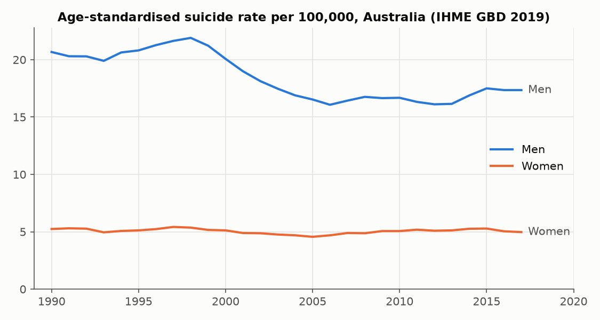
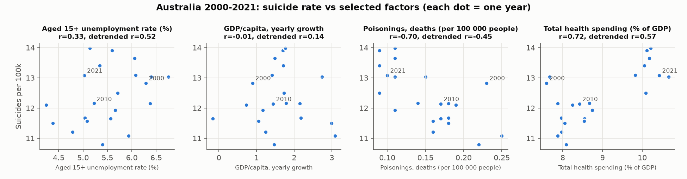
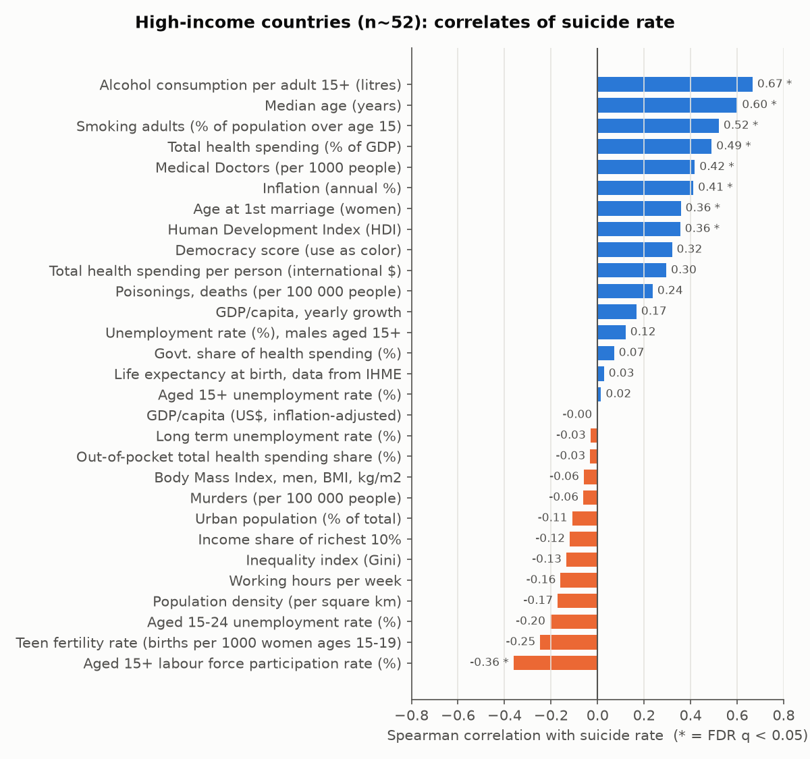
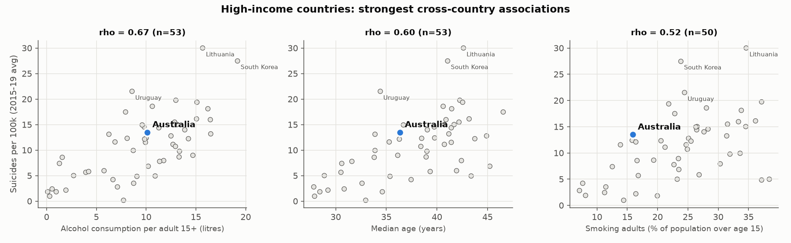

# Suicide rates in Australia: an exploratory correlation analysis

**Status:** exploratory and hypothesis-generating only. Every result below is an
*ecological* correlation, meaning national aggregates rather than individuals.
None of them is causal.

Reproduce: `pip install -r requirements.txt && python fetch_data.py && python analysis.py`

## Data

| What | Source (as compiled) | Coverage |
|---|---|---|
| Suicide deaths per 100k (total, men, women) | WHO Global Health Observatory, via Gapminder Systema Globalis | 185 countries, 2000–2021 |
| Age-standardised suicide rate by sex | IHME GBD 2019, via Our World in Data | 1990–2017 |
| ~30 covariates: unemployment (ILO), GDP, inflation, Gini (World Bank), alcohol, smoking, BMI, health spending (WHO), median age and density (UN WPP), homicide and poisonings (IHME), HDI (UNDP), etc. | Gapminder Systema Globalis | varies (see `outputs/*.csv`) |

These are GitHub-hosted mirrors of the primary sources. The session's network
blocked abs.gov.au, aihw.gov.au, who.int and worldbank.org. **Before you cite any
number, check it against the primary source.** For Australian work, the
best primary sources are:

- **AIHW National Suicide & Self-harm Monitoring System** (monthly and state-level
  data, method, age, sex, Indigenous status, and self-harm hospitalisations).
- **ABS Causes of Death, Australia (cat. 3303.0)**: coroner-certified counts
  by age, sex, state and year back to the 1900s.
- **ABS Census / Labour Force** and **AIHW alcohol & drug** data for covariates
  at state or SA2 level. Linking these to AIHW regional suicide data gives
  far more statistical power than 22 national data points.

Data-quality note: the per-age-group columns in the OWID IHME file are
internally inconsistent. For example, Australian males aged 15–19 go 18 → 11 → 42 → 8
per 100k at adjacent points. I discarded them and kept only the
age-standardised series.

## Descriptive picture

- Australia's crude suicide rate fell from **12.8 per 100k in 2000** to about 10.8 in
  2004, then rose to about **14.0 in 2019**. It dipped to about 13.0 in 2020–21, which
  is consistent with the widely reported absence of a COVID-era rise.
- Men die by suicide at about **3× the rate of women** (19.5 vs 6.7 per 100k in 2021).
  Women's rates rose proportionally more after 2004 (4.8 → 7.1), which
  narrowed the ratio. IHME's age-standardised series agrees: M:F was 3.9 in 1990
  and 3.5 in 2017.
- Among 53 high-income countries (2015–19 average), Australia ranks
  **18th highest**. That puts it mid-pack, well below Lithuania and South Korea.

## A. Within Australia over time (2000–2021, n ≈ 22 years)

File: `outputs/A_australia_timeseries_correlations.csv`

Three versions of each correlation are reported, because trending series
correlate with anything else that trends:

1. **Levels**: raw Pearson r. This is highly vulnerable to spurious trend correlation.
2. **Detrended**: correlation of residuals after removing each series' linear trend.
3. **Year-on-year changes**: correlation of first differences. This is the strictest version.

| Factor | r (levels) | r (detrended) | r (changes) |
|---|---|---|---|
| Unemployment rate, 15+ | 0.33 | **0.52** (q=0.04) | −0.07 |
| Male unemployment, 15+ | 0.35 | **0.54** (q=0.03) | −0.07 |
| Long-term unemployment | 0.49 | **0.54** (q=0.03) | 0.03 |
| Youth (15–24) unemployment | 0.49 | 0.46 (q=0.07) | −0.05 |
| Total health spending, % GDP | 0.72 | 0.57 (q=0.03) | 0.21 |
| GDP per capita growth | −0.01 | 0.14 | 0.17 |

How to read these:

- The **unemployment signal** is the most substantively credible. A
  large literature links unemployment and recessions to male suicide, and the
  association survives detrending. It does *not* show up in year-on-year changes. With
  n=21, that test has very little power, and the effect may be lagged or build up
  over several years (long-term unemployment has the strongest detrended r).
- **Health spending** rising alongside suicide almost certainly reflects shared
  timing, not a causal effect. The WHO series jumps from 8.7% to 9.8% in 2014, which looks like an accounting-method break rather than a real change. Detrending with a single
  straight line can't remove a U-shaped trend. That same artefact explains the
  "significant" detrended correlations with population density and median
  age. Treat those as noise.
- No year-on-year association survives multiple-testing correction (all q > 0.78).

## B. Across countries (2015–19 averages)

File: `outputs/B_cross_country_correlations.csv` (also gives Australia's percentile on each factor)

Among high-income countries (n ≈ 50), the factors most associated with higher
suicide rates are:

- **Alcohol consumption per adult** (ρ = 0.67). This is the strongest and most
  consistent correlate, and it also holds across all 180 countries (ρ = 0.48). Alcohol
  is a well-established individual-level risk factor, but the cross-national signal is
  heavily shaped by Eastern Europe and the Baltics (Lithuania, Latvia, Hungary,
  Slovenia).
- **Median age** (ρ = 0.60). Older populations have higher crude rates, partly
  because suicide rates are high in middle and old age. This is why age-standardised
  rates should be preferred for comparisons.
- **Smoking prevalence** (ρ = 0.52). It is likely a marker of shared
  cultural and socioeconomic patterns, and it overlaps strongly with alcohol.
- **Health spending and doctors per capita** (ρ ≈ 0.4–0.5). This is almost certainly
  confounding by age and wealth, and possibly better death certification. It is
  not evidence that health care raises suicide.
- Unemployment, Gini and GDP per capita show **essentially no cross-sectional
  association** among rich countries. That contrasts with the within-Australia
  time-series signal, which is a textbook example of why between-country and
  within-country associations can differ.

A multivariable model (`outputs/B_multivariable_high_income.txt`, n=50,
standardised coefficients, robust SEs) finds that median age (β≈0.48) and
poisoning deaths (β≈0.56) remain associated when included together. With n=50 and
correlated predictors, these estimates are unstable.

## Caveats you should state in any write-up

- **Ecological fallacy**: a national correlation says nothing about which
  individuals are at risk.
- **Tiny n**: 22 years for Australia and about 50 countries. About 30 factors were
  tested, so we report Benjamini–Hochberg q-values, and even those
  assume independence that the data don't have.
- **Reporting differences**: coroner practices, stigma, and how undetermined-intent
  deaths are classified vary across countries and over time. Australia's
  ABS figures also get revised as coronial cases close.
- **Missing key variables**: rates of mental illness and treatment, firearm and
  means access, rurality, Aboriginal and Torres Strait Islander status, drought, and
  gambling. These are central to Australian suicide epidemiology but aren't in
  these international datasets. Several of them exist at state or regional level in AIHW
  and ABS data.

## Ideas for stronger follow-up designs

1. **State/territory or SA3-level panel** (AIHW + ABS). Use fixed-effects regression
   with year and region effects, so each region acts as its own control.
2. **Interrupted time series** around specific policies, e.g. the 1996 National
   Firearms Agreement, Better Access (2006), or the COVID-19 supplements (2020).
3. **Lagged / distributed-lag models** of unemployment, e.g. ABS monthly Labour Force
   against AIHW monthly suspected-suicide data from coronial systems.
4. **Age- and sex-specific outcomes** (ABS 3303.0). Aggregate rates hide
   diverging trends, such as rises among young women.
